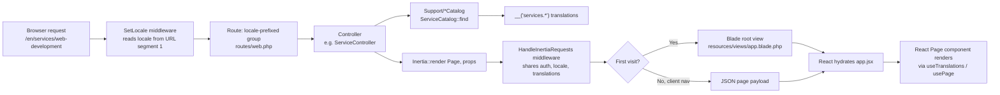

<p align="center">
  
</p>

> A localized, Inertia-driven marketing and client-portal site for Ozytech Agency, a software engineering agency. Built on Laravel 13 + React 18, rendered through Inertia.js with no separate REST/JSON API layer.


---

## Table of Contents

1. [Overview](#overview)
2. [Tech Stack](#tech-stack)
3. [Architecture](#architecture)
4. [Internationalization (i18n)](#internationalization-i18n)
5. [Design System](#design-system)
6. [Pages & Routes](#pages--routes)
7. [Content Catalogs](#content-catalogs)
8. [Authentication & Dashboard](#authentication--dashboard)
9. [Project Structure](#project-structure)
10. [Getting Started](#getting-started)
11. [Available Scripts](#available-scripts)
12. [Testing & Code Style](#testing--code-style)
13. [Known Limitations & Roadmap](#known-limitations--roadmap)

---

## Overview

Ozytech Agency's site is a single Laravel application that serves both the public marketing site (Home, About, Services, Packages, Blog, FAQ, Contact, Start a Project) and an authenticated client area (Dashboard, Profile) — all through **one monolithic Inertia stack**, no separate frontend/backend deployment or JSON API to maintain.

Every page is a **React component rendered server-side per request** via Inertia — the server decides which component to render and what props/translations to hand it; React only takes over in the browser for interactivity and client-side navigation between pages.

Key characteristics:

- **Fully localized** — every route is prefixed with a locale segment (`/en`, `/ar`, `/fr`, `/es`), including native RTL support for Arabic.
- **Content-as-code** — service and policy detail pages are generated from small PHP "catalog" classes plus per-locale translation files, not a database.
- **No content database** — the only persisted entity is `User` (via Laravel Breeze auth scaffolding). Marketing content lives in `lang/*` and `app/Support/*Catalog.php`.
- **Design-token driven UI** — a Material Design 3–inspired token system (colors, spacing, type scale) is wired into Tailwind via CSS custom properties, so the whole UI is theme-consistent and dark-mode ready.

---

## Tech Stack

| Layer | Technology | Notes |
|---|---|---|
| Backend framework | Laravel 13 (PHP 8.3+) | Standard MVC, no dedicated API layer |
| SPA bridge | Inertia.js 2.0 | `inertiajs/inertia-laravel` server adapter + `@inertiajs/react` client |
| Frontend | React 18 | Function components, hooks only |
| Styling | Tailwind CSS 3 + `@tailwindcss/forms` | Extended with CSS-variable design tokens |
| Bundler | Vite 8 (`laravel-vite-plugin`) | HMR in dev, versioned manifest in prod |
| Routing helper | Ziggy | Exposes named Laravel routes to JS via `route()` |
| Auth scaffolding | Laravel Breeze (Inertia/React stack) | Login, register, password reset, email verification, profile |
| Tooling | Laravel Boost, Pint, Pail, PHPUnit | AI-assisted dev tooling, code style, logs, tests |
| Database | SQLite by default (`.env.example`) | Swappable via standard Laravel `DB_*` env vars |

---

## Architecture

There is no REST API — every navigation is a full or partial **Inertia visit**: the client asks the server for a page, the server resolves a controller, and the controller returns `Inertia::render('PageName', [...props])`, which either full-page-loads (first visit) or swaps in via XHR + client-side render (subsequent navigations).



**Request lifecycle detail:**

1. **`SetLocale` middleware** (`app/Http/Middleware/SetLocale.php`) runs globally, before routing resolves the `{locale}` route parameter, and reads the locale directly from the first URL segment. It calls `App::setLocale()` and `URL::defaults(['locale' => ...])` so every `route()` call and `__()` translation call downstream is already locale-aware.
2. **Route group** in `routes/web.php` prefixes all pages with `{locale}` constrained to `^(en|ar|fr|es)$`. The root `/` redirects to `/en`.
3. **Controllers** are intentionally thin — `PageController` for static marketing pages, `ServiceController`/`PolicyController` for catalog-driven detail pages.
4. **`HandleInertiaRequests` middleware** (`app/Http/Middleware/HandleInertiaRequests.php`) shares global props with *every* page: the authenticated user, current `locale`, `available_locales`, and a `translations` object containing every registered namespace's strings — so the client never has to issue a separate call to fetch copy.
5. **Client bootstrap** (`resources/js/app.jsx`) wires up `createInertiaApp`, resolves page components from `resources/js/Pages/**/*.jsx`, and keeps two things in sync on every navigation: the `<html lang>` / `dir` attributes (for RTL), and Ziggy's `defaults.locale` (see callout below).

> **Why the Ziggy `beforeUpdate` listener exists:** Ziggy's `window.Ziggy.defaults` is populated once from the server on the very first full page load. Client-side Inertia navigations never re-run that server-side bootstrap, so without explicitly refreshing `Ziggy.defaults.locale` on every navigation, any `route(name)` call that omits an explicit locale (i.e. most `<Link>`s in the header/footer) would keep resolving against the *first* locale ever visited. This is patched in `resources/js/app.jsx` via `router.on('beforeUpdate', ...)`, and `Ziggy` is exposed on `window` from `resources/views/app.blade.php` so the ES-module app bundle can reach it.

---

## Internationalization (i18n)

| Aspect | Implementation |
|---|---|
| Supported locales | `en`, `ar`, `fr`, `es` (`en` is default/fallback) |
| URL shape | `/{locale}/...` for every route, including auth and dashboard |
| RTL | Automatic — `document.documentElement.dir` is set to `rtl` for `ar`, `ltr` otherwise, on every navigation |
| Translation storage | Standard Laravel PHP arrays under `lang/{locale}/{namespace}.php` |
| Delivery to the client | *All* translation namespaces are eagerly shared as Inertia props (`translations.*`) on every request — the client never lazy-loads copy |
| Client-side lookup | `useTranslations()` (`resources/js/lib/translations.js`) returns a `t('namespace.key.path', fallback)` function that walks the shared object by dot-path |
| Active-locale helper | `useLocale()` returns `{ locale, availableLocales }` for building the language switcher |

**Registered translation namespaces** (`HandleInertiaRequests::$translationNamespaces`):

`nav`, `footer`, `home`, `about`, `blog`, `packages`, `contact`, `start_a_project`, `services`, `policies`, `auth_pages`, `faq`, `dashboard`

Each namespace has one file per locale, e.g. `lang/en/services.php`, `lang/ar/services.php`, `lang/fr/services.php`, `lang/es/services.php` — all four **must stay structurally identical** (same keys) since pages index into them positionally/by-key without a per-locale fallback in the client.

**RTL-specific styling notes:**
- Arabic body copy is forced onto the `Tajawal` font family (`html[lang='ar'] body`), with a standalone `.font-tajawal` utility class for Arabic text that appears outside an `html[lang='ar']` context (e.g., the "العربية" label in the language switcher while browsing another locale).
- Phone numbers and other inherently LTR strings (e.g. `+212 654-092321`) are wrapped with `dir="ltr"` so they don't visually reverse inside RTL layouts.

---

## Design System

The UI is built on a **Material Design 3–style token system**, implemented as CSS custom properties and surfaced to Tailwind through `tailwind.config.js`:

- **Color roles**, not raw hex values — `primary`, `on-primary`, `primary-container`, `surface-container-{lowest…highest}`, `secondary-fixed-dim`, `accent2` (the brand red/orange accent used for CTAs), etc. Every color resolves through `rgb(var(--c-*) / <alpha-value>)`, so opacity modifiers (`bg-primary/60`) work naturally and the whole palette can be re-themed by swapping CSS variables (dark mode is `class`-strategy, see `resources/js/Hooks/useDarkMode.js`).
- **Spacing scale** — semantic tokens (`space-xs` → `space-4xl`, plus `gutter-mobile` / `gutter-desktop`) instead of arbitrary Tailwind spacing numbers.
- **Type scale** — semantic font-size tokens (`display-xl`, `headline-lg`, `body-md`, `label-sm`, `stat-counter`, …) pairing size, line-height, tracking, and weight in one Tailwind utility, so headings are consistent everywhere without repeating four classes.
- **Container convention** — page sections use `mx-[6%]` as the horizontal gutter (a percentage-based margin that scales with viewport width), replacing an earlier `max-w-max-width mx-auto px-gutter-*` pattern.
- **Motion/interaction primitives** — `Reveal.jsx` (scroll-triggered fade/slide-in, with a `stagger` mode for grids), `CountUp.jsx` (animated numeric counters for stat sections), and hover/focus-aware dropdowns (e.g. the services mega-menu opens on hover *and* click/focus for accessibility).

---

## Pages & Routes

All routes below are additionally prefixed with `/{locale}`.

| Path | Route name | Controller / Handler | Auth required |
|---|---|---|---|
| `/` | `home` | `PageController@home` | No |
| `/about` | `about` | `PageController@about` | No |
| `/start-a-project` | `start-a-project` | `PageController@startAProject` | No |
| `/contact` | `contact` | `PageController@contact` | No |
| `/blog` | `blog` | `PageController@blog` | No |
| `/packages` | `packages` | `PageController@packages` | No |
| `/faq` | `faq` | `PageController@faq` | No |
| `/services/{service}` | `services.show` | `ServiceController@show` | No |
| `/policies/{policy}` | `policies.show` | `PolicyController@show` | No |
| `/dashboard` | `dashboard` | Closure in `routes/web.php` | Yes (`auth`, `verified`) |
| `/profile` | `profile.edit` / `.update` / `.destroy` | `ProfileController` | Yes (`auth`) |
| `/login`, `/register`, `/forgot-password`, `/reset-password`, `/verify-email`, `/confirm-password` | — | Breeze `Auth\*` controllers (`routes/auth.php`) | Mixed (guest/auth) |

### Page-by-page summary

- **Home** — hero, services capability grid, delivery-model section, "guild" (about) teaser, animated impact stats (`CountUp`), testimonials, solutions, closing CTA.
- **About** — photo hero, founder profiles with initials-avatars and social links (data currently inlined per-locale in `lang/*/about.php` + `TEAM_SOCIALS`/`TEAM_AVATAR_STYLES` in `About.jsx`), operating principles, numbers section, closing CTA.
- **Services `/services/{slug}`** — dynamically rendered from `ServiceCatalog`: title, lead, body, feature list, image gallery, related-services cross-links. 20 services are defined (see [Content Catalogs](#content-catalogs)).
- **Packages** — three pricing tiers (Growth / Pro / Ultimate), each with a price + billing period, a feature list where individual features can carry an info-tooltip (`FeatureNote` component) explaining a caveat (e.g. "Website: Shopify, WooCommerce, or WordPress — pick whichever fits your business").
- **Start a Project** — the primary lead-generation funnel: hero, inquiry routing guidance, a multi-field inquiry form (client-side only — see [Known Limitations](#known-limitations--roadmap)), office locations, and an FAQ accordion scoped to project-starting questions.
- **Contact** — a lighter-weight alternative to Start a Project: contact details (phone/WhatsApp/email/address) without the full inquiry form.
- **FAQ `/faq`** — standalone, site-wide FAQ page (split out from the Start-a-Project-scoped FAQ section).
- **Blog** — hero + featured post + latest-posts grid + CTA (currently static/demo content, no CMS/database backing).
- **Policies `/policies/{slug}`** — legal pages driven by `PolicyCatalog`: `privacy-policy`, `terms-of-service`, `refunds-policy`, `trust-security`.
- **Dashboard** (auth-only) — personalized greeting, workspace feature highlights, quick links (Start a Project / Packages / Contact / FAQ), and an account summary card (email verification status, member-since date, edit-profile/logout actions).
- **Auth pages** (`Login`, `Register`, `ForgotPassword`, `ResetPassword`, `ConfirmPassword`, `VerifyEmail`) — standard Breeze flows, now rendered inside the shared marketing `SiteLayout` (header/footer/language switcher) rather than a bespoke auth-only chrome.

---

## Content Catalogs

Two content types are modeled as **PHP value catalogs** instead of database tables, since their content is fully translated, low-cardinality, and edited by developers rather than end users:

### `App\Support\ServiceCatalog`

- `SLUGS` — the canonical, ordered list of 20 service slugs (e.g. `web-development`, `llc-incorporation`, `cyber-security`, `ecommerce`, …). This list is the single source of truth for which service pages exist.
- `GALLERIES` — a slug → list-of-Unsplash-photo-IDs map, kept separate from translation files since images are not locale-dependent copy.
- `ServiceCatalog::all()` / `::find($slug)` — merge translated copy (`__("services.{$slug}")`) with the gallery URLs.
- `ServiceCatalog::related($current, $limit = 3)` — deterministically picks the next N services after the current one in `SLUGS` (wrapping around), for the "related services" cross-link section.

> **Renaming or removing a service** means updating `SLUGS`/`GALLERIES` in this class *and* the matching key in all four `lang/*/services.php` files (and `nav.js` / `lang/*/nav.php` if it's also in the header mega-menu) — there is no runtime validation keeping these in sync beyond the `services.show` route 404ing via `NotFoundHttpException` if a slug isn't in `SLUGS`.

### `App\Support\PolicyCatalog`

- `SLUGS` — `privacy-policy`, `terms-of-service`, `refunds-policy`, `trust-security`.
- `PolicyCatalog::all()` / `::find($slug)` — pull each policy's `{title, subtitle, sections[]}` structure straight from `__("policies.{$slug}")`.

---

## Authentication & Dashboard

Authentication is stock **Laravel Breeze (Inertia + React)**:

- Single `User` model/migration (`database/migrations/0001_01_01_000000_create_users_table.php`) — no roles, teams, or additional profile fields beyond Breeze defaults.
- Full auth surface: registration, login, logout, password reset, password confirmation, email verification, profile edit/delete — see `tests/Feature/Auth/*` for coverage of each flow.
- `AuthenticatedLayout` and `GuestLayout` were both rebuilt to mount on the shared `SiteLayout` (same header/footer/language switcher as the public site) instead of maintaining a separate authenticated-app chrome, so logged-in and logged-out experiences feel like one cohesive product rather than "marketing site" + "bolted-on app."
- The Dashboard (`resources/js/Pages/Dashboard.jsx`) is presentation-only today: it reads `auth.user` and the `dashboard` translation namespace, and surfaces links into the rest of the app (Start a Project, Packages, Contact, FAQ) — there is no client-portal data (projects, invoices, tickets) wired up yet.

---

## Project Structure

```
app/
  Http/
    Controllers/          # PageController, ServiceController, PolicyController, Auth/*, ProfileController
    Middleware/
      SetLocale.php        # resolves {locale} before routing, sets App locale + URL defaults
      HandleInertiaRequests.php  # shares auth/locale/translations props on every Inertia response
    Requests/
  Models/User.php
  Providers/AppServiceProvider.php
  Support/
    ServiceCatalog.php     # 20 services: slugs, galleries, related-service lookup
    PolicyCatalog.php      # 4 legal pages

lang/{en,ar,fr,es}/
  nav.php  footer.php  home.php  about.php  blog.php  packages.php
  contact.php  start_a_project.php  services.php  policies.php
  auth_pages.php  faq.php  dashboard.php

resources/
  css/app.css              # design tokens, RTL font rules, dropdown/hover behavior
  views/app.blade.php      # Inertia root view; exposes window.Ziggy
  js/
    app.jsx                # Inertia bootstrap, locale <html> sync, Ziggy locale patch
    lib/translations.js    # useTranslations() / useLocale()
    data/nav.js             # servicesNav / websiteNav mega-menu entries
    Layouts/
      SiteLayout.jsx         # header + <main> + footer + language switcher shell
      AuthenticatedLayout.jsx
      GuestLayout.jsx
    Components/
      SiteHeader.jsx  SiteFooter.jsx  LanguageSwitcher.jsx
      Reveal.jsx  CountUp.jsx  TechMarquee.jsx  ...
    Pages/
      Home.jsx  About.jsx  Blog.jsx  Contact.jsx  Packages.jsx
      StartAProject.jsx  Faq.jsx  Dashboard.jsx
      Services/Show.jsx  Policies/Show.jsx
      Auth/*  Profile/*

routes/
  web.php                  # locale-prefixed route group
  auth.php                 # Breeze auth routes (included inside the locale group)

tests/
  Feature/Auth/*            # coverage for every Breeze auth flow
  Feature/ProfileTest.php
```

---

## Getting Started

```bash
# 1. Install PHP & JS dependencies
composer install
npm install

# 2. Environment
cp .env.example .env
php artisan key:generate

# 3. Database (SQLite by default — file must exist)
touch database/database.sqlite
php artisan migrate

# 4. Run the app (Laravel server + queue listener + Vite, concurrently)
composer run dev
```

`composer run dev` runs `php artisan serve`, `php artisan queue:listen`, `php artisan pail` (log tailing), and `npm run dev` (Vite) concurrently — see the `dev` script in `composer.json`. Visit `http://localhost:8000`, which redirects to `/en`.

---

## Available Scripts

| Command | Purpose |
|---|---|
| `composer run dev` | Full local dev stack: server + queue + logs + Vite HMR |
| `composer run setup` | Fresh-clone bootstrap: install deps, `.env`, key, migrate, build assets |
| `npm run dev` | Vite dev server only (HMR) |
| `npm run build` | Production asset build |
| `php artisan route:list` | Inspect all registered routes |
| `php artisan test` / `vendor/bin/phpunit` | Run the PHPUnit test suite |
| `vendor/bin/pint --dirty --format agent` | Auto-fix PHP code style on changed files |

---

## Testing & Code Style

- **PHPUnit** feature tests cover the full Breeze auth surface (registration, login, logout, password reset/update/confirmation, email verification) plus profile management. There is currently **no test coverage for the marketing pages, service/policy catalogs, or locale middleware** — a natural place to expand coverage as those areas stabilize.
- **Laravel Pint** enforces PHP code style; run it on any changed PHP file before committing.
- No JS test runner (Jest/Vitest/RTL) is configured yet — frontend changes are verified manually in-browser.

---

## Known Limitations & Roadmap

- **Start a Project / inquiry form is not persisted.** `StartAProject.jsx` manages the form entirely in local React state (`useState`) and simulates a success screen — there is no backend route, validation, database table, or notification/email wired up yet. Turning this into a real lead pipeline (a `POST` route, an `Inquiry` model, and an email/Slack notification) is the most impactful backend gap.
- **Blog has no CMS.** Posts on `/blog` are static/demo content hard-coded in `Blog.jsx`; there's no `Post` model, admin authoring UI, or pagination.
- **Dashboard is presentation-only.** It has no real client-portal data (project status, invoices, support tickets) — only navigational shortcuts and account info.
- **Content/translation drift risk.** Because `ServiceCatalog`/`PolicyCatalog` slugs and the four per-locale translation files are updated independently by hand, a mismatched key across locales fails silently on the client (the `t()` helper falls back to the raw key or an explicit fallback) rather than erroring loudly — worth a CI check that diffs key sets across `lang/{en,ar,fr,es}/*.php` if this grows further.
